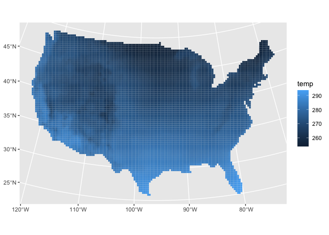
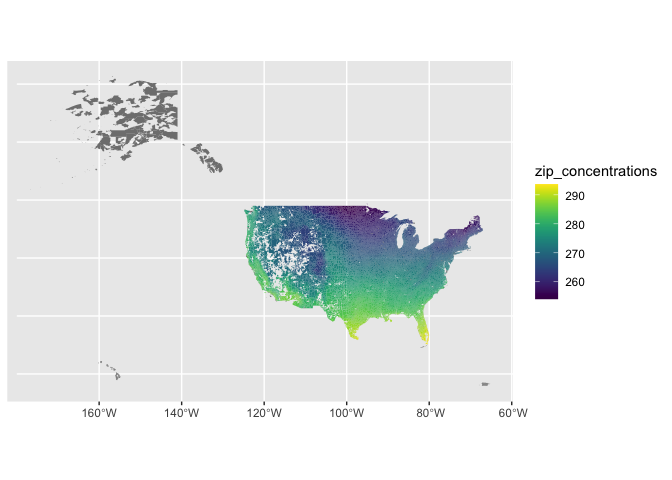

# mets


## met raster


<!-- -->

## download zipcode polygons


## crosswalk example


```
## Warning in rasterToPolygons(rast_i): no values in selection

## Warning in rasterToPolygons(rast_i): no values in selection

## Warning in rasterToPolygons(rast_i): no values in selection

## Warning in rasterToPolygons(rast_i): no values in selection

## Warning in rasterToPolygons(rast_i): no values in selection

## Warning in rasterToPolygons(rast_i): no values in selection

## Warning in rasterToPolygons(rast_i): no values in selection

## Warning in rasterToPolygons(rast_i): no values in selection

## Warning in rasterToPolygons(rast_i): no values in selection

## Warning in rasterToPolygons(rast_i): no values in selection

## Warning in rasterToPolygons(rast_i): no values in selection

## Warning in rasterToPolygons(rast_i): no values in selection

## Warning in rasterToPolygons(rast_i): no values in selection

## Warning in rasterToPolygons(rast_i): no values in selection

## Warning in rasterToPolygons(rast_i): no values in selection

## Warning in rasterToPolygons(rast_i): no values in selection

## Warning in rasterToPolygons(rast_i): no values in selection

## Warning in rasterToPolygons(rast_i): no values in selection

## Warning in rasterToPolygons(rast_i): no values in selection

## Warning in rasterToPolygons(rast_i): no values in selection

## Warning in rasterToPolygons(rast_i): no values in selection

## Warning in rasterToPolygons(rast_i): no values in selection

## Warning in rasterToPolygons(rast_i): no values in selection

## Warning in rasterToPolygons(rast_i): no values in selection

## Warning in rasterToPolygons(rast_i): no values in selection

## Warning in rasterToPolygons(rast_i): no values in selection

## Warning in rasterToPolygons(rast_i): no values in selection

## Warning in rasterToPolygons(rast_i): no values in selection

## Warning in rasterToPolygons(rast_i): no values in selection

## Warning in rasterToPolygons(rast_i): no values in selection

## Warning in rasterToPolygons(rast_i): no values in selection

## Warning in rasterToPolygons(rast_i): no values in selection

## Warning in rasterToPolygons(rast_i): no values in selection

## Warning in rasterToPolygons(rast_i): no values in selection

## Warning in rasterToPolygons(rast_i): no values in selection

## Warning in rasterToPolygons(rast_i): no values in selection

## Warning in rasterToPolygons(rast_i): no values in selection

## Warning in rasterToPolygons(rast_i): no values in selection

## Warning in rasterToPolygons(rast_i): no values in selection

## Warning in rasterToPolygons(rast_i): no values in selection

## Warning in rasterToPolygons(rast_i): no values in selection

## Warning in rasterToPolygons(rast_i): no values in selection

## Warning in rasterToPolygons(rast_i): no values in selection

## Warning in rasterToPolygons(rast_i): no values in selection

## Warning in rasterToPolygons(rast_i): no values in selection

## Warning in rasterToPolygons(rast_i): no values in selection

## Warning in rasterToPolygons(rast_i): no values in selection

## Warning in rasterToPolygons(rast_i): no values in selection

## Warning in rasterToPolygons(rast_i): no values in selection

## Warning in rasterToPolygons(rast_i): no values in selection

## Warning in rasterToPolygons(rast_i): no values in selection

## Warning in rasterToPolygons(rast_i): no values in selection

## Warning in rasterToPolygons(rast_i): no values in selection

## Warning in rasterToPolygons(rast_i): no values in selection

## Warning in rasterToPolygons(rast_i): no values in selection

## Warning in rasterToPolygons(rast_i): no values in selection

## Warning in rasterToPolygons(rast_i): no values in selection

## Warning in rasterToPolygons(rast_i): no values in selection

## Warning in rasterToPolygons(rast_i): no values in selection

## Warning in rasterToPolygons(rast_i): no values in selection

## Warning in rasterToPolygons(rast_i): no values in selection

## Warning in rasterToPolygons(rast_i): no values in selection

## Warning in rasterToPolygons(rast_i): no values in selection

## Warning in rasterToPolygons(rast_i): no values in selection

## Warning in rasterToPolygons(rast_i): no values in selection

## Warning in rasterToPolygons(rast_i): no values in selection

## Warning in rasterToPolygons(rast_i): no values in selection

## Warning in rasterToPolygons(rast_i): no values in selection

## Warning in rasterToPolygons(rast_i): no values in selection

## Warning in rasterToPolygons(rast_i): no values in selection

## Warning in rasterToPolygons(rast_i): no values in selection

## Warning in rasterToPolygons(rast_i): no values in selection

## Warning in rasterToPolygons(rast_i): no values in selection

## Warning in rasterToPolygons(rast_i): no values in selection

## Warning in rasterToPolygons(rast_i): no values in selection

## Warning in rasterToPolygons(rast_i): no values in selection

## Warning in rasterToPolygons(rast_i): no values in selection

## Warning in rasterToPolygons(rast_i): no values in selection

## Warning in rasterToPolygons(rast_i): no values in selection

## Warning in rasterToPolygons(rast_i): no values in selection

## Warning in rasterToPolygons(rast_i): no values in selection

## Warning in rasterToPolygons(rast_i): no values in selection

## Warning in rasterToPolygons(rast_i): no values in selection

## Warning in rasterToPolygons(rast_i): no values in selection

## Warning in rasterToPolygons(rast_i): no values in selection

## Warning in rasterToPolygons(rast_i): no values in selection

## Warning in rasterToPolygons(rast_i): no values in selection

## Warning in rasterToPolygons(rast_i): no values in selection

## Warning in rasterToPolygons(rast_i): no values in selection

## Warning in rasterToPolygons(rast_i): no values in selection

## Warning in rasterToPolygons(rast_i): no values in selection

## Warning in rasterToPolygons(rast_i): no values in selection

## Warning in rasterToPolygons(rast_i): no values in selection

## Warning in rasterToPolygons(rast_i): no values in selection

## Warning in rasterToPolygons(rast_i): no values in selection

## Warning in rasterToPolygons(rast_i): no values in selection

## Warning in rasterToPolygons(rast_i): no values in selection

## Warning in rasterToPolygons(rast_i): no values in selection

## Warning in rasterToPolygons(rast_i): no values in selection

## Warning in rasterToPolygons(rast_i): no values in selection

## Warning in rasterToPolygons(rast_i): no values in selection

## Warning in rasterToPolygons(rast_i): no values in selection

## Warning in rasterToPolygons(rast_i): no values in selection

## Warning in rasterToPolygons(rast_i): no values in selection

## Warning in rasterToPolygons(rast_i): no values in selection

## Warning in rasterToPolygons(rast_i): no values in selection

## Warning in rasterToPolygons(rast_i): no values in selection

## Warning in rasterToPolygons(rast_i): no values in selection

## Warning in rasterToPolygons(rast_i): no values in selection

## Warning in rasterToPolygons(rast_i): no values in selection

## Warning in rasterToPolygons(rast_i): no values in selection

## Warning in rasterToPolygons(rast_i): no values in selection

## Warning in rasterToPolygons(rast_i): no values in selection

## Warning in rasterToPolygons(rast_i): no values in selection

## Warning in rasterToPolygons(rast_i): no values in selection

## Warning in rasterToPolygons(rast_i): no values in selection

## Warning in rasterToPolygons(rast_i): no values in selection

## Warning in rasterToPolygons(rast_i): no values in selection

## Warning in rasterToPolygons(rast_i): no values in selection

## Warning in rasterToPolygons(rast_i): no values in selection

## Warning in rasterToPolygons(rast_i): no values in selection

## Warning in rasterToPolygons(rast_i): no values in selection

## Warning in rasterToPolygons(rast_i): no values in selection

## Warning in rasterToPolygons(rast_i): no values in selection

## Warning in rasterToPolygons(rast_i): no values in selection

## Warning in rasterToPolygons(rast_i): no values in selection

## Warning in rasterToPolygons(rast_i): no values in selection

## Warning in rasterToPolygons(rast_i): no values in selection

## Warning in rasterToPolygons(rast_i): no values in selection

## Warning in rasterToPolygons(rast_i): no values in selection

## Warning in rasterToPolygons(rast_i): no values in selection

## Warning in rasterToPolygons(rast_i): no values in selection

## Warning in rasterToPolygons(rast_i): no values in selection

## Warning in rasterToPolygons(rast_i): no values in selection

## Warning in rasterToPolygons(rast_i): no values in selection

## Warning in rasterToPolygons(rast_i): no values in selection

## Warning in rasterToPolygons(rast_i): no values in selection

## Warning in rasterToPolygons(rast_i): no values in selection

## Warning in rasterToPolygons(rast_i): no values in selection

## Warning in rasterToPolygons(rast_i): no values in selection

## Warning in rasterToPolygons(rast_i): no values in selection

## Warning in rasterToPolygons(rast_i): no values in selection

## Warning in rasterToPolygons(rast_i): no values in selection

## Warning in rasterToPolygons(rast_i): no values in selection

## Warning in rasterToPolygons(rast_i): no values in selection

## Warning in rasterToPolygons(rast_i): no values in selection

## Warning in rasterToPolygons(rast_i): no values in selection

## Warning in rasterToPolygons(rast_i): no values in selection

## Warning in rasterToPolygons(rast_i): no values in selection

## Warning in rasterToPolygons(rast_i): no values in selection

## Warning in rasterToPolygons(rast_i): no values in selection

## Warning in rasterToPolygons(rast_i): no values in selection

## Warning in rasterToPolygons(rast_i): no values in selection

## Warning in rasterToPolygons(rast_i): no values in selection

## Warning in rasterToPolygons(rast_i): no values in selection

## Warning in rasterToPolygons(rast_i): no values in selection

## Warning in rasterToPolygons(rast_i): no values in selection

## Warning in rasterToPolygons(rast_i): no values in selection

## Warning in rasterToPolygons(rast_i): no values in selection

## Warning in rasterToPolygons(rast_i): no values in selection

## Warning in rasterToPolygons(rast_i): no values in selection

## Warning in rasterToPolygons(rast_i): no values in selection

## Warning in rasterToPolygons(rast_i): no values in selection

## Warning in rasterToPolygons(rast_i): no values in selection

## Warning in rasterToPolygons(rast_i): no values in selection

## Warning in rasterToPolygons(rast_i): no values in selection

## Warning in rasterToPolygons(rast_i): no values in selection

## Warning in rasterToPolygons(rast_i): no values in selection

## Warning in rasterToPolygons(rast_i): no values in selection

## Warning in rasterToPolygons(rast_i): no values in selection

## Warning in rasterToPolygons(rast_i): no values in selection

## Warning in rasterToPolygons(rast_i): no values in selection

## Warning in rasterToPolygons(rast_i): no values in selection

## Warning in rasterToPolygons(rast_i): no values in selection

## Warning in rasterToPolygons(rast_i): no values in selection

## Warning in rasterToPolygons(rast_i): no values in selection

## Warning in rasterToPolygons(rast_i): no values in selection

## Warning in rasterToPolygons(rast_i): no values in selection

## Warning in rasterToPolygons(rast_i): no values in selection

## Warning in rasterToPolygons(rast_i): no values in selection

## Warning in rasterToPolygons(rast_i): no values in selection

## Warning in rasterToPolygons(rast_i): no values in selection

## Warning in rasterToPolygons(rast_i): no values in selection

## Warning in rasterToPolygons(rast_i): no values in selection

## Warning in rasterToPolygons(rast_i): no values in selection

## Warning in rasterToPolygons(rast_i): no values in selection

## Warning in rasterToPolygons(rast_i): no values in selection

## Warning in rasterToPolygons(rast_i): no values in selection

## Warning in rasterToPolygons(rast_i): no values in selection

## Warning in rasterToPolygons(rast_i): no values in selection

## Warning in rasterToPolygons(rast_i): no values in selection

## Warning in rasterToPolygons(rast_i): no values in selection

## Warning in rasterToPolygons(rast_i): no values in selection

## Warning in rasterToPolygons(rast_i): no values in selection

## Warning in rasterToPolygons(rast_i): no values in selection

## Warning in rasterToPolygons(rast_i): no values in selection

## Warning in rasterToPolygons(rast_i): no values in selection

## Warning in rasterToPolygons(rast_i): no values in selection

## Warning in rasterToPolygons(rast_i): no values in selection

## Warning in rasterToPolygons(rast_i): no values in selection

## Warning in rasterToPolygons(rast_i): no values in selection

## Warning in rasterToPolygons(rast_i): no values in selection

## Warning in rasterToPolygons(rast_i): no values in selection

## Warning in rasterToPolygons(rast_i): no values in selection

## Warning in rasterToPolygons(rast_i): no values in selection

## Warning in rasterToPolygons(rast_i): no values in selection

## Warning in rasterToPolygons(rast_i): no values in selection

## Warning in rasterToPolygons(rast_i): no values in selection

## Warning in rasterToPolygons(rast_i): no values in selection

## Warning in rasterToPolygons(rast_i): no values in selection

## Warning in rasterToPolygons(rast_i): no values in selection

## Warning in rasterToPolygons(rast_i): no values in selection

## Warning in rasterToPolygons(rast_i): no values in selection

## Warning in rasterToPolygons(rast_i): no values in selection

## Warning in rasterToPolygons(rast_i): no values in selection

## Warning in rasterToPolygons(rast_i): no values in selection

## Warning in rasterToPolygons(rast_i): no values in selection

## Warning in rasterToPolygons(rast_i): no values in selection

## Warning in rasterToPolygons(rast_i): no values in selection

## Warning in rasterToPolygons(rast_i): no values in selection

## Warning in rasterToPolygons(rast_i): no values in selection

## Warning in rasterToPolygons(rast_i): no values in selection

## Warning in rasterToPolygons(rast_i): no values in selection

## Warning in rasterToPolygons(rast_i): no values in selection

## Warning in rasterToPolygons(rast_i): no values in selection

## Warning in rasterToPolygons(rast_i): no values in selection

## Warning in rasterToPolygons(rast_i): no values in selection

## Warning in rasterToPolygons(rast_i): no values in selection

## Warning in rasterToPolygons(rast_i): no values in selection

## Warning in rasterToPolygons(rast_i): no values in selection

## Warning in rasterToPolygons(rast_i): no values in selection

## Warning in rasterToPolygons(rast_i): no values in selection

## Warning in rasterToPolygons(rast_i): no values in selection

## Warning in rasterToPolygons(rast_i): no values in selection

## Warning in rasterToPolygons(rast_i): no values in selection

## Warning in rasterToPolygons(rast_i): no values in selection

## Warning in rasterToPolygons(rast_i): no values in selection

## Warning in rasterToPolygons(rast_i): no values in selection

## Warning in rasterToPolygons(rast_i): no values in selection

## Warning in rasterToPolygons(rast_i): no values in selection

## Warning in rasterToPolygons(rast_i): no values in selection

## Warning in rasterToPolygons(rast_i): no values in selection

## Warning in rasterToPolygons(rast_i): no values in selection

## Warning in rasterToPolygons(rast_i): no values in selection

## Warning in rasterToPolygons(rast_i): no values in selection

## Warning in rasterToPolygons(rast_i): no values in selection

## Warning in rasterToPolygons(rast_i): no values in selection

## Warning in rasterToPolygons(rast_i): no values in selection

## Warning in rasterToPolygons(rast_i): no values in selection

## Warning in rasterToPolygons(rast_i): no values in selection

## Warning in rasterToPolygons(rast_i): no values in selection

## Warning in rasterToPolygons(rast_i): no values in selection

## Warning in rasterToPolygons(rast_i): no values in selection

## Warning in rasterToPolygons(rast_i): no values in selection

## Warning in rasterToPolygons(rast_i): no values in selection

## Warning in rasterToPolygons(rast_i): no values in selection

## Warning in rasterToPolygons(rast_i): no values in selection

## Warning in rasterToPolygons(rast_i): no values in selection

## Warning in rasterToPolygons(rast_i): no values in selection

## Warning in rasterToPolygons(rast_i): no values in selection

## Warning in rasterToPolygons(rast_i): no values in selection

## Warning in rasterToPolygons(rast_i): no values in selection
```

<!-- -->
