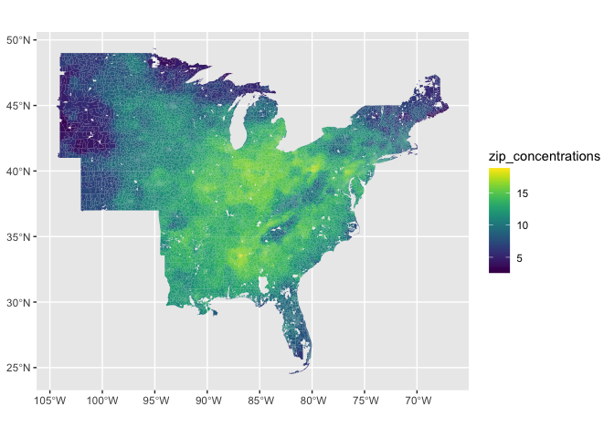
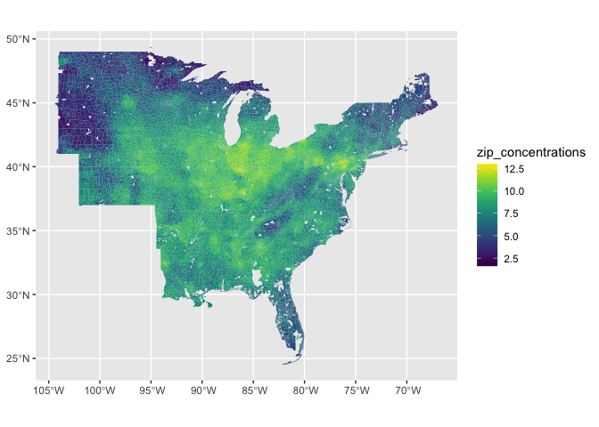
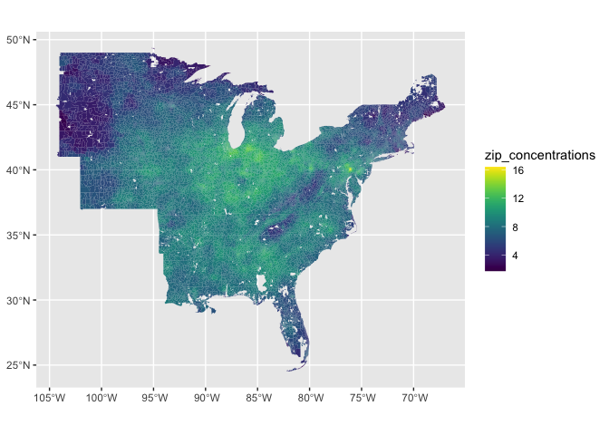

# pm25


## 2005


```
## Loading required package: sp
```

```
## Warning in st_simplify.sfc(st_geometry(x), preserveTopology, dTolerance):
## st_simplify does not correctly simplify longitude/latitude data, dTolerance
## needs to be in decimal degrees
```

<!-- -->

## 2013


```
## Warning in st_simplify.sfc(st_geometry(x), preserveTopology, dTolerance):
## st_simplify does not correctly simplify longitude/latitude data, dTolerance
## needs to be in decimal degrees
```

<!-- -->

## 2014


```
## Warning in st_simplify.sfc(st_geometry(x), preserveTopology, dTolerance):
## st_simplify does not correctly simplify longitude/latitude data, dTolerance
## needs to be in decimal degrees
```

<!-- -->
